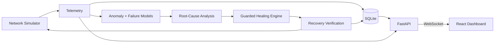

# Aegis Net — AI-Driven Self-Healing Computer Network

A complete college-level Computer Networks project that simulates a small enterprise network, streams live telemetry, detects anomalies with Isolation Forest, classifies likely failures with Random Forest, explains the probable cause, applies a guarded simulated recovery, verifies the result, and records the full incident in SQLite.

> **Scope:** all devices, traffic, failures, and healing actions are explicitly simulated. The machine-learning models are genuinely trained and used for inference; this project does not claim to operate physical infrastructure.

## Why this project exists

Traditional monitoring tells an operator after something breaks. A self-healing design closes the loop: observe, identify risk, diagnose, act, and verify. This prototype makes that workflow visible and safe enough for a classroom demonstration on a normal laptop, without Mininet or router hardware.

## Highlights

- Eight-node stateful network simulator with gradual degradation
- Seven injectible scenarios: congestion, high latency, packet loss, device overload, device failure, link failure, and traffic spike
- 9,000-row reproducible synthetic dataset
- Isolation Forest anomaly detection with anomaly score
- Balanced Random Forest failure classifier with probability distribution
- Time-window trend analysis labelled honestly as **Failure Risk Prediction**
- Explainable root-cause evidence for every predicted failure
- Guarded healing with severity, cooldown, verification, and rollback
- FastAPI REST API plus one-second WebSocket updates
- Polished responsive React/Vite/Recharts network-operations dashboard
- SQLite history for telemetry, incidents, predictions, actions, and system events
- Automated simulator, ML, healing, and API tests

## Architecture



Detailed diagrams are in [docs/ARCHITECTURE.md](docs/ARCHITECTURE.md).

## Technology stack

| Layer | Technology |
|---|---|
| Simulator/backend | Python 3.11+, FastAPI, asyncio, WebSockets |
| ML/data | pandas, NumPy, scikit-learn, joblib |
| Frontend | React, Vite, Recharts, Lucide icons, custom utility-oriented CSS |
| Persistence | SQLite |
| Tests | pytest, FastAPI TestClient |

## Project structure

```text
ai-self-healing-network/
├── backend/
│   ├── api/                 # Request schemas
│   ├── database/            # SQLite schema and repository
│   ├── healing/             # Root-cause and guarded action engine
│   ├── ml/                  # Training and inference services
│   ├── network/             # Stateful simulator and telemetry model
│   └── main.py              # API, WebSocket, orchestration loop
├── data/network_telemetry.csv
├── docs/                    # Architecture, viva, demo script
├── frontend/src/            # React dashboard
├── models/                  # Generated joblib models and metrics
├── scripts/generate_dataset.py
└── tests/
```

## Quick start

### Prerequisites

- Python 3.11 or newer
- Node.js 20 or newer

### 1. Backend setup

```powershell
cd ai-self-healing-network
python -m venv .venv
.\.venv\Scripts\Activate.ps1
pip install -r requirements.txt
```

macOS/Linux activation: `source .venv/bin/activate`.

### 2. Generate data and train models

The repository includes the generated CSV and trained artifacts in a working checkout. To reproduce them:

```powershell
python scripts/generate_dataset.py --rows 9000 --seed 42
python -m backend.ml.train_model
```

Training writes `models/anomaly_detector.joblib`, `models/failure_classifier.joblib`, and `models/metrics.json`.

### 3. Start the backend

```powershell
python -m uvicorn backend.main:app --reload --port 8000
```

API documentation: [http://localhost:8000/docs](http://localhost:8000/docs)

### 4. Start the frontend

In a second terminal:

```powershell
cd frontend
npm install
npm run dev
```

Open [http://localhost:5173](http://localhost:5173).

## Synthetic dataset

Every record has timestamp, device identity/type, latency, packet loss, bandwidth utilization, throughput, jitter, CPU, memory, error rate, interface utilization, device status, and failure label.

The generator uses overlapping ranges to avoid turning classification into a trivial threshold table:

| Failure | Learned pattern |
|---|---|
| Congestion | Very high link utilization, rising latency/loss/jitter, reduced useful throughput |
| Device overload | Very high CPU and memory with processing delay |
| Link failure | Near-total loss, high errors, near-zero interface use and throughput |
| Device failure | Unreachable node, near-total loss and near-zero resource/traffic readings |
| Traffic spike | Abrupt high throughput, utilization, and CPU pressure |
| Normal | Broad healthy ranges with natural noise |

The live simulator does not replay the CSV. It independently evolves state each second and gradually increases fault intensity, giving the models new rows to classify.

## Machine learning

### Isolation Forest

The detector is fitted only on normal training samples. It outputs normal/anomalous, the native decision value, and a normalized dashboard anomaly score.

### Random Forest

The classifier uses 180 trees, balanced class weights, a stratified 78/22 split, and all nine numeric metrics. Evaluation saves accuracy, macro F1, per-class precision/recall/F1, and a confusion matrix. Macro F1 is the primary summary because accuracy alone can hide minority-class errors.

### Failure Risk Prediction

For each device, the last six samples are retained. Linear slopes for latency, loss, and utilization form a bounded risk score. The dashboard says that a problem *may develop within the next monitoring window*; it does not claim an exact failure time.

## Safe self-healing sequence

```text
Detect → Diagnose → Select → Check severity/cooldown → Execute simulated action
       → Verify post-action metrics → Success or rollback to safe baseline
```

| Diagnosis | Simulated recovery |
|---|---|
| Congestion / high latency | Reroute through backup path |
| Device overload | Redistribute load |
| Link failure | Activate backup link |
| Device failure | Switch to redundant device |
| Traffic spike | Apply adaptive rate limiting |
| Unstable interface / loss | Restart interface |

The same device/action pair has a 20-second cooldown. Low-severity findings are observed rather than automatically changed. All selections, blocks, executions, verifications, and rollbacks are audited.

## Network health score

Each device starts at 100 and receives capped penalties for latency above 25 ms, packet loss, utilization above 70%, CPU above 70%, and offline status. Network health is the mean device score with a five-point active-incident penalty, clamped to 0–100. See the exact formula in [docs/ARCHITECTURE.md](docs/ARCHITECTURE.md).

## REST API

| Method | Endpoint | Purpose |
|---|---|---|
| GET | `/api/network/status` | Current health and counters |
| GET | `/api/devices` | Topology and device state |
| GET | `/api/telemetry` | Persisted telemetry, filterable by device |
| GET | `/api/anomalies` | Non-normal predictions |
| GET | `/api/incidents` | Incident history and before/after data |
| GET | `/api/healing-actions` | Recovery audit trail |
| GET | `/api/events` | Timeline events |
| GET | `/api/model/metrics` | Saved evaluation report |
| POST | `/api/fault/inject` | Begin a controlled fault |
| POST | `/api/fault/restore` | Restore simulator baseline |
| POST | `/api/healing/execute` | Request a policy-gated action |
| WS | `/ws/telemetry` | Live network snapshot stream |

## Demo procedure

1. Start backend and frontend.
2. Confirm **LIVE STREAM** and a healthy topology.
3. Click **Inject congestion**.
4. Watch Router R1 metrics degrade gradually.
5. Observe real model classification, risk, evidence, and root cause.
6. Watch the affected path change from warning to blue healing state.
7. See the timeline complete and metrics stabilize.
8. Review the before/after recovery analytics.

### Watching the backend terminal

Keep the backend PowerShell window visible while using Demo Mode. It now prints the same closed-loop sequence with `[AEGIS]` labels:

```text
[AEGIS][DEMO][R1] fault injected=CONGESTION
[AEGIS][TELEMETRY][CONGESTION][R1] stage=4/10 | latency=... | loss=... | bandwidth=...
[AEGIS][DETECTION][R1] anomaly=true
[AEGIS][PREDICTION][R1] failure=CONGESTION | confidence=...
[AEGIS][ROOT-CAUSE][R1] ...
[AEGIS][HEALING][R1] action=REROUTE_TRAFFIC
[AEGIS][RECOVERED][R1] verified=true | latency ...->... | loss ...->...
```

The telemetry line identifies the active scenario—`CONGESTION`, `LINK_FAILURE`, `DEVICE_OVERLOAD`, or `TRAFFIC_SPIKE`—and shows its metrics changing once per second.

Use [docs/DEMO_SCRIPT.md](docs/DEMO_SCRIPT.md) for a timed 3–5 minute presentation and [docs/VIVA_GUIDE.md](docs/VIVA_GUIDE.md) for likely questions.

## Testing

```powershell
pytest -q
cd frontend
npm run build
```

## Screenshots

Add classroom screenshots here after running the dashboard:

- Healthy live topology
- Congestion detection and AI analysis
- Blue healing path and timeline
- Before/after recovery analytics

## Limitations

- Telemetry and actions are simulated, not taken from physical switches or routers.
- Synthetic training distributions are cleaner than real networks and can cause optimistic metrics.
- The topology is intentionally small and single-site.
- The trend score is a transparent heuristic, not a survival/time-to-failure model.
- There is no authentication because the default deployment is localhost-only classroom use.

## Future improvements

- Optional Mininet adapter behind the current simulator interface
- SNMP, gNMI, syslog, NetFlow, or sFlow collectors
- Authenticated role-based change approvals
- SHAP explanations and drift monitoring
- Graph/topology-aware failure correlation
- Canary changes and production-grade rollback playbooks
- Prometheus/Grafana or time-series database integration

## Responsible use

Do not connect this educational automation directly to real infrastructure. Production self-healing requires device authentication, least privilege, approval policies, maintenance windows, idempotent actions, audit retention, and tested rollback procedures.
