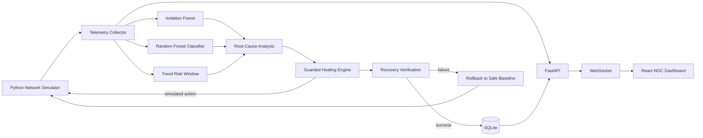
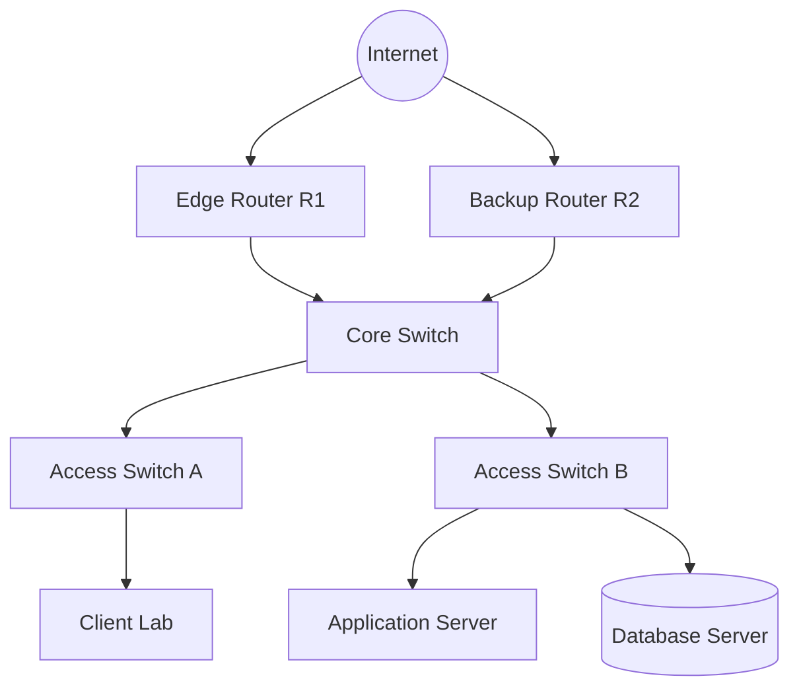
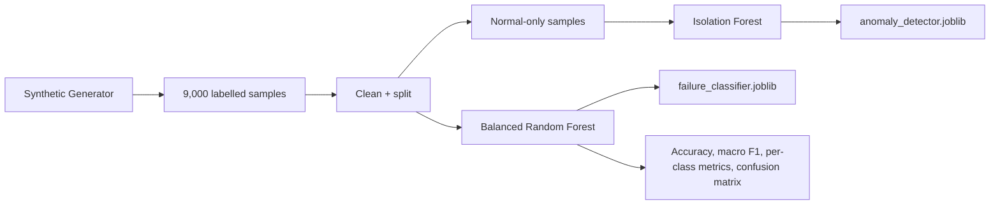
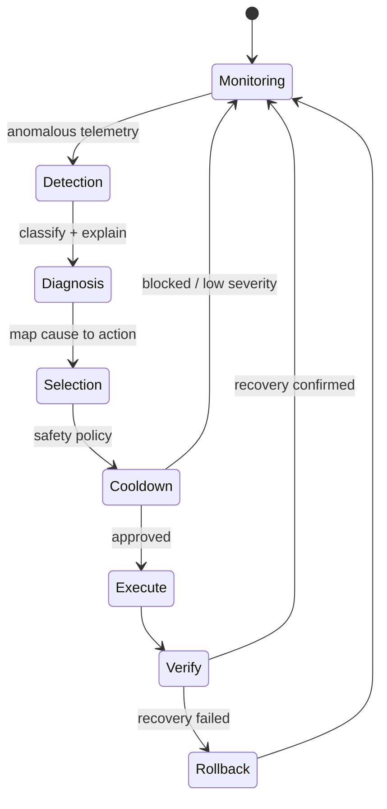

# Architecture

## System architecture

## Simulated network topology

## ML pipeline

## Self-healing workflow

## Network health formula

For each device, health starts at 100. Penalties are capped so one noisy metric cannot dominate:

- Latency: `min(22, max(0, latency_ms - 25) × 0.14)`
- Packet loss: `min(28, packet_loss_percent × 2.2)`
- Bandwidth: `min(14, max(0, utilization - 70) × 0.45)`
- CPU: `min(12, max(0, CPU - 70) × 0.4)`
- Offline device: `35` points

The network score is the mean device score, minus 5 while an incident is active, clamped to 0–100. This is a transparent demonstration score, not an industry standard.

